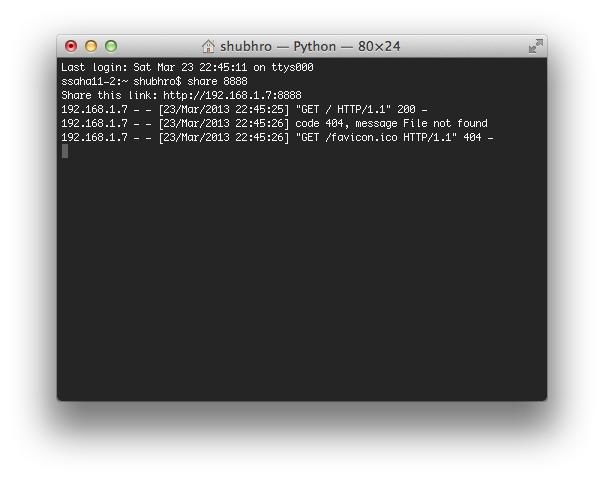

instant-sharing
===
This is a super-simple script lets you instantly share files across a local network with SimpleHTTPServer. See http://www.princeton.edu/~saha/instant-sharing/ for more information.

How it Works
---
This Python script lets you run a simple command from any directory and a SimpleHTTPServer instance will be opened at the specified port #. In addition, you'll get a URL that includes your IP address so you can easily share the directory with friends.

Installation
---
For the best experience, download share.py and run these commands on a Unix system:

    mv share.py share
    chmod +x share
    cd /usr/local/bin/
    sudo ln -s ~/path/to/share .

Now you're ready to start sharing! Just type the following from any directory on your computer:

    share [port#]
    
For example, you can type:

    share 8000
    
The script will print a link you can share with friends on the local network.
